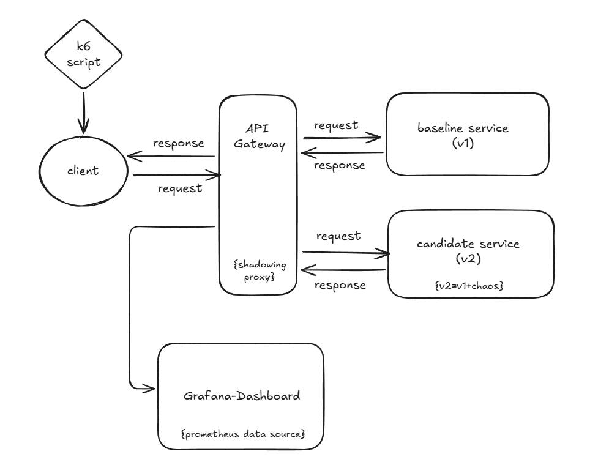

# MirrorLab – Traffic Shadowing Proxy

MirrorLab is an end-to-end demo of **safe releases**:

- A **Go** proxy/API gateway that:
    - Forwards real requests to a **baseline** service.
    - Silently **mirrors** a sample of traffic to a **candidate** service.
    - Compares responses and latency.
    - Automatically **disables mirroring** when the candidate behaves badly, then auto re-enables it after a cooldown.
- Two **Java (Spring Boot)** services:
    - `service-v1` – baseline (no chaos).
    - `service-v2` – candidate (configurable latency and error injection).
- **Prometheus + Grafana** with a pre-provisioned dashboard to visualize RPS, latency, errors, diffs, and guardrail behaviour.
- A **k6** load script to drive traffic through the proxy.

This project is aimed at showing real-world skills around:

- Safe rollout patterns (traffic shadowing / dark launching).
- SLO-style thinking and guardrails.
- Go, Java 21, containerization.
- Observability and dashboards under load.

---

## Architecture

High-level flow:

1. Clients send traffic to the Go **proxy**.
2. Proxy forwards the request to the **baseline (v1)** service and returns that response to the caller.
3. Proxy optionally **mirrors** the same request to the **candidate (v2)** in the background.
4. Proxy compares baseline vs candidate responses, tracks latency and errors, and updates metrics.
5. If the candidate is consistently slower or more error-prone, the guardrail **disables mirroring**.
6. After a cooldown, the guardrail **auto re-enables** mirroring on the first new request past the cooldown.
7. Prometheus scrapes metrics; Grafana shows an auto-provisioned dashboard.




---

## Features

- **Non-blocking traffic mirroring**
    - User-facing response always comes from the baseline service.
    - Mirroring to candidate happens asynchronously and is sampled by `MIRROR_FRACTION`.

- **Response comparison with simple PII masking**
    - JSON responses from baseline and candidate are:
        - Parsed and normalized.
        - Certain keys ignored (timestamps, trace IDs, request IDs).
        - Simple PII-like fields (`email`, `phone`, `name`, `cc_last4`) are masked.
    - Structural differences are counted as mismatches per route.

- **Latency and error guardrail**
    - For each mirrored pair, the proxy records:
        - Baseline vs candidate latency.
        - Baseline vs candidate error outcome.
    - If candidate is consistently slower than baseline by a configurable ratio, or has worse errors:
        - Mirroring is disabled (abort).
        - `mirror_enabled` becomes `0`.
        - `mirror_aborts_total` is incremented.
    - After a configurable cooldown (default 10 seconds) the guardrail re-allows mirroring on the next incoming request.

- **Observability**
    - Proxy exposes Prometheus metrics:
        - Requests, latency histograms, diff mismatches.
        - Guardrail state and abort events.
    - Java services expose Micrometer/Prometheus metrics via `/actuator/prometheus`.
    - Prometheus scrapes all three.
    - Grafana is provisioned with:
        - Prometheus data source.
        - A dashboard under folder `MirrorLab` → `MirrorLab – Shadowing Overview`.

- **Load generation with k6**
    - A k6 script exercises:
        - `GET /api/search`
        - `GET /api/product/{id}`
        - `POST /api/checkout`
    - Can be run locally or as a Docker container on the same network as the proxy.

---

## Tech stack

- **Proxy / Gateway**
    - Go (tested with Go 1.25.x)
    - net/http
    - github.com/prometheus/client_golang

- **Demo services**
    - Java 21
    - Spring Boot 3.x
    - Spring Web + Actuator
    - Micrometer + Prometheus

- **Observability**
    - Prometheus
    - Grafana (with provisioning)

- **Containers / Orchestration**
    - Docker
    - Docker Compose

- **Load**
    - k6 (CLI or grafana/k6 Docker image)

---

## Repository layout

```text
└── mirrorlab-traffic-shadowing/
├── .mvn/                  # Maven wrapper
├── docs/
│   └── architecture.png   # Architecture diagram
├── observability/
│   └── prometheus.yml     # Prometheus scrape config
├── proxy/                 # Go proxy / API gateway
│   ├── main.go
│   ├── config.go
│   ├── metrics.go
│   ├── guardrail.go
│   ├── diff.go
│   └── proxy_handler.go
├── grafana/
│   └── provisioning/
│       ├── datasources/
│       │   └── datasource.yml
│       └── dashboards/
│           └── dashboards.yml
├── dashboards/
│   └── mirrorlab-shadowing.json  # Predefined dashboard
├── load/
│   └── k6-shadow.js       # k6 load script
├── src/                   # Java Spring Boot service code
├── target/                # Java build output
├── .gitattributes
├── .gitignore
├── compose.yaml           # Runs proxy, services, Prometheus, Grafana
├── Dockerfile             # Java service image
├── HELP.md                # Spring Boot generated help
├── mvnw                   # Maven wrapper script (Unix)
├── mvnw.cmd               # Maven wrapper script (Windows)
└── pom.xml
```

---

## Getting started

### Prerequisites

- Docker
- Docker Compose

Optional for local development:

- Go 1.25+ (for running proxy without Docker)
- JDK 21 (for running Java service without Docker)
- k6 (for local load testing) or just Docker for grafana/k6

### Clone and run

From the repository root:

```bash
git clone https://github.com/psydak143/mirrorlab-traffic-shadowing
cd mirrorlab-traffic-shadowing

# build and start proxy, services, Prometheus, Grafana
docker compose up --build
```

Once everything is running:

- Proxy: `http://localhost:8080`
- Baseline direct: `http://localhost:4001`
- Candidate direct: `http://localhost:4002`
- Prometheus: `http://localhost:9090`
- Grafana: `http://localhost:3000`

Grafana:

- Login: `admin` / `admin` (unless overridden).
- You should see a folder `MirrorLab` with dashboard `MirrorLab – Shadowing Overview` already provisioned and connected to the Prometheus datasource.

---

## Configuration

### Proxy (Go)

Configured via environment variables in `compose.yaml`:

- `BASELINE_URL`  
  URL for baseline service.  
  Default: `http://service-v1:4001`

- `CANDIDATE_URL`  
  URL for candidate service.  
  Default: `http://service-v2:4002`

- `MIRROR_FRACTION`  
  Fraction of requests to mirror (0.0–1.0).  
  Example: `0.25` for 25%.

- `LISTEN_ADDR`  
  Listen address for the proxy.  
  Default: `:8080`

Guardrail configuration:

- `ABORT_P99_RATIO`  
  Latency ratio threshold. If candidate latency is consistently greater than `ABORT_P99_RATIO * baseline`, it counts as a breach.

- `ABORT_ERROR_DELTA`  
  Simple error threshold. If candidate errors while baseline does not, it contributes to breaches. This is coarse but enough for demo.

- `ABORT_CONSECUTIVE`  
  Number of consecutive breached pairs needed to trigger an abort (disable mirroring).

- `ABORT_COOLDOWN`  
  Optional env to override cooldown. Parsed as an integer number of seconds.  
  If unset, defaults to 10 seconds in code.

If `ABORT_COOLDOWN` is unset:

- Cooldown is `10 * time.Second` as a default.

If set:

- `ABORT_COOLDOWN=20` → 20 seconds.

Control endpoints:

- `GET /healthz` – liveness probe.
- `GET /metrics` – Prometheus metrics for the proxy.
- `GET /control/status` – JSON describing guardrail status:
    - enabled/disabled
    - last abort reason
    - breach streak
    - cooldown
- `POST /control/enable` – manually re-enable mirroring.
- `POST /control/disable` – manually disable mirroring.

### Java services (Spring Boot)

Both v1 and v2 are the same Spring Boot application image, configured differently via environment variables:

- `SERVICE_NAME` – label for Micrometer metrics (e.g. `service-v1`, `service-v2`).
- `PORT` – service port:
    - Baseline: 4001
    - Candidate: 4002
- `CHAOS_LATENCY_MS` – base latency injected on each request for that instance (0 for baseline).
- `CHAOS_JITTER_MS` – extra random latency in `[0, CHAOS_JITTER_MS]`.
- `CHAOS_ERROR_RATE` – probability of returning an injected 500 (e.g. `0.02` = 2% errors).

Prometheus metrics endpoint:

- `/actuator/prometheus`

HTTP metrics expose:

- Requests, latency buckets, status codes, outcomes.
- Tag `service` is used to distinguish v1 vs v2.

---

## Observability stack

### Prometheus

Config: `observability/prometheus.yml`

- Scrapes:
    - `proxy:8080/metrics`
    - `service-v1:4001/actuator/prometheus`
    - `service-v2:4002/actuator/prometheus`
- Scrape interval: 5 seconds.

### Grafana provisioning

Data source provisioning (`grafana/provisioning/datasources/datasource.yml`):

- Creates a Prometheus data source with UID `prometheus` pointing to `http://prometheus:9090`.

Dashboard provisioning (`grafana/provisioning/dashboards/dashboards.yml`):

- Loads JSON dashboards from `/var/lib/grafana/dashboards`.
- In Compose, that is bound to the repository `dashboards/` folder.

Dashboard:

- `dashboards/mirrorlab-shadowing.json`
- Title: `MirrorLab – Shadowing Overview`
- Folder: `MirrorLab`

Key panels:

- RPS by target (baseline vs candidate).
- p99 latency by target.
- Error rate (baseline vs candidate) using `http_server_requests_seconds_count`.
- Diff mismatches per second (by route).
- Mirroring enabled (stat: 1 or 0).
- Guardrail aborts (total).
- RPS by route and target.

---

## Endpoints

### Through the proxy

Preferred for demos:

- `GET /api/search?q=<term>`
- `GET /api/product/{id}`
- `POST /api/checkout`

Example calls:

```bash
# Search
curl "http://localhost:8080/api/search?q=ssd"

# Product
curl "http://localhost:8080/api/product/p-100"

# Checkout
curl -X POST "http://localhost:8080/api/checkout" ^
-H "content-type: application/json" ^
-d "{\"productIds\":[\"p-100\",\"p-104\"],\"email\":\"demo@example.com\"}"
```

(Adjust quoting depending on shell; the above is Windows cmd style. On Unix, remove the carets and escape differently.)

### Direct services

For debugging:

- Baseline:
    - `http://localhost:4001/api/...`
    - `http://localhost:4001/actuator/prometheus`
- Candidate:
    - `http://localhost:4002/api/...`
    - `http://localhost:4002/actuator/prometheus`

---

## k6 load testing

The k6 script (`load/k6-shadow.js`) drives traffic through the proxy:

- Mixes:
    - `GET /api/search`
    - `GET /api/product/{id}`
    - `POST /api/checkout`
- Uses a constant number of virtual users.

Options inside the script:

- `BASE_URL` – default `http://localhost:8080` (can be overridden).
- `VUS` – number of virtual users (default 50).
- `DURATION` – test duration (default `5m`).

### Running k6 locally (if installed)

```bash
cd mirrorlab-traffic-shadowing/mirrorlab

# Default settings
k6 run .\load\k6-shadow.js

# Override settings
set BASE_URL=http://localhost:8080
set VUS=100
set DURATION=3m
k6 run .\load\k6-shadow.js
```

(Replace with Unix env syntax if not on Windows.)

### Running k6 via Docker (no local install)

From the `mirrorlab` directory, with the stack running:

```bash
docker compose up --build
```

Then, in another terminal (Windows cmd example):

```bash
cd C:\mirrorlab-traffic-shadowing\mirrorlab

docker run --rm -it ^
--network mirrorlab-traffic-shadowing-main_default ^
-v "%cd%\load:/scripts" ^
-e BASE_URL=http://proxy:8080 ^
grafana/k6 run /scripts/k6-shadow.js
```

Notes:

- `--network mirrorlab_default` puts k6 on the same Docker network as the proxy.
- Inside that network, the proxy is reachable as `http://proxy:8080` (service name from Compose), not `localhost`.

--- 

## Metrics reference

From Go proxy:

- `mirror_requests_total{route, target}`  
  Total proxied/mirrored requests per route and target (`baseline`, `candidate`).

- `mirror_latency_seconds_bucket{route, target, le}`  
  Histogram buckets for upstream latency. Used for p50/p90/p99 via histogram_quantile.

- `mirror_diff_mismatches_total{route}`  
  Count of response mismatches after JSON normalization and PII masking.

- `mirror_enabled`  
  Gauge: 1 if mirroring is currently allowed, 0 if disabled.

- `mirror_aborts_total`  
  Counter: number of times mirroring has been disabled by the guardrail or manual disable.

From Java services (Micrometer):

- `http_server_requests_seconds_count{service, status, uri, ...}`  
  HTTP request counts per service. Used for error rate via `status=~"5.."`.

- `http_server_requests_seconds_bucket{service, ...}`  
  Latency histogram buckets per service.

---

## License

MIT.
